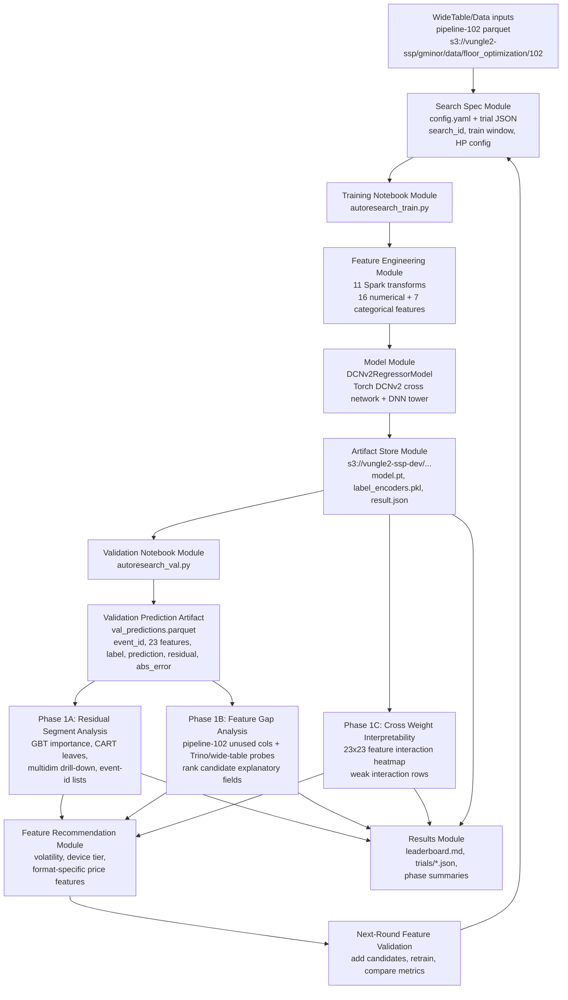
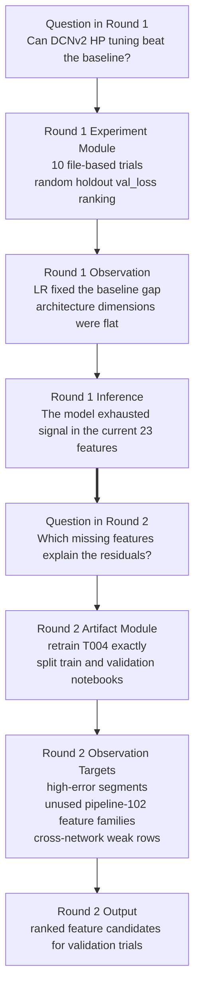

# MachineLearning Process Diagram

This review covers `components/MachineLearning` as an offline modeling and
feature-analysis loop for DCNv2 floor optimization.

## Main Intent: Round 1 to Round 2

The main intent of this work is the handoff from Round 1 to Round 2:

1. Round 1 searched DCNv2 hyperparameters and found a flat plateau.
2. The plateau showed that architecture changes were no longer producing useful gains.
3. Round 2 intentionally reuses the best Round 1 model setup, then creates artifacts for feature-gap analysis.
4. The next model improvement should come from better features, not another blind architecture sweep.

```mermaid
flowchart LR
    subgraph R1["Round 1 Module: HP Search"]
        R1CFG["R1 Search Config\n2026-06-27-dcnv2-hp-initial\n7-day pipeline-102 sample"]
        R1TRIALS["R1 Trial Runner\n10 DCNv2 trials\nLR, DNN width, cross depth, embedding dim"]
        R1BEST["R1 Best Trial Module\ntrial 004\nval_loss 1.1565e-05\nT004 HP config"]
        R1PLATEAU["R1 Plateau Diagnosis\nwell-configured trials all near 1.157e-05\ncross=1 ~= cross=3 ~= cross=5"]
    end

    subgraph HANDOFF["Decision Handoff Module"]
        DECISION["Key Decision\nStop broad HP search\nTreat plateau as feature bottleneck"]
        CARRY["Carry Forward\nsame 23 features\nsame T004 HP config\nsame pipeline-102 source"]
        CHANGE["Change Evaluation Shape\ntemporal validation split\nsave model + validation residual artifacts"]
    end

    subgraph R2["Round 2 Module: Artifact and Feature-Gap Analysis"]
        R2CFG["R2 Artifact Config\n2026-07-01-dcnv2-r2-artifacts\nT004 retrain, val_split=0.0"]
        R2TRAIN["R2 Training Module\nautoresearch_train.py\nwrites model.pt, label_encoders.pkl, result.json"]
        R2VAL["R2 Validation Module\nautoresearch_val.py\nwrites val_predictions.parquet"]
        R2A["Phase 1A Residual Module\nsegment analysis\nhigh-error cohorts"]
        R2B["Phase 1B Gap Module\nunused pipeline-102 cols\nTrino/wide-table probes"]
        R2C["Phase 1C Cross Module\nmodel.pt interaction heatmap\nweak interaction rows"]
        R2REC["Feature Recommendation Module\nprice volatility\ndevice tier\nformat-specific price stats"]
    end

    R1CFG --> R1TRIALS --> R1BEST --> R1PLATEAU
    R1PLATEAU ==> DECISION
    DECISION ==> CARRY
    DECISION ==> CHANGE
    CARRY ==> R2CFG
    CHANGE ==> R2CFG
    R2CFG --> R2TRAIN --> R2VAL
    R2VAL --> R2A
    R2VAL --> R2B
    R2TRAIN --> R2C
    R2A --> R2REC
    R2B --> R2REC
    R2C --> R2REC
```

The important connection is that Round 2 is a controlled diagnostic continuation
of Round 1. It holds the best Round 1 HP setup constant so residual analysis can
explain what the model cannot learn from the current 23-feature set.

## Directory Modules

| Module | Path | Role |
|---|---|---|
| Component contract | `README.md` | Defines the MachineLearning component as the offline modeling, simulation, and feature-validation layer. |
| Experiment specs | `spec/` | Round plans, search configs, and Databricks notebook exports. This is the main source for intended process. |
| Round 1 summary module | `spec/ROUND1_SUMMARY.md` | Explains the initial HP search, best trial, plateau, and why Round 2 should move toward feature analysis. |
| Round 2 plan module | `spec/ROUND2_PLAN.md` | Defines Round 2 as a T004 retrain plus residual, gap, and cross-weight analysis. |
| Search config module | `spec/searches/*/config.yaml` | Declares search id, input parquet path, train window, model-output bucket, control HP config, and metric direction. |
| Training notebook module | `spec/searches/*/notebooks_databricks/autoresearch_train.py` | Loads pipeline-102 parquet, applies feature engineering, trains DCNv2, and writes train artifacts. |
| Validation notebook module | `spec/searches/2026-07-01-dcnv2-r2-artifacts/notebooks_databricks/autoresearch_val.py` | Loads saved model artifacts, runs temporal validation inference, and writes `val_predictions.parquet`. |
| CPU validation variant | `spec/searches/2026-07-01-dcnv2-r2-artifacts/notebooks_databricks/autoresearch_val_cpu.py` | Validation variant kept alongside the GPU path. |
| Phase 1A segment analysis | `spec/searches/2026-07-01-dcnv2-r2-artifacts/notebooks_databricks/phase1a_segment_analysis.py` | Uses validation residuals to find high-error segments and event-id lists. |
| Phase 1B feature gap findings | `results/round2/phase1b/` | Records Trino/wide-table feature-gap notes and candidate rank lists. |
| Phase 1C cross weights | `spec/searches/2026-07-01-dcnv2-r2-artifacts/notebooks_databricks/phase1c_cross_weights.py` | Reads `model.pt` and produces a 23x23 DCNv2 interaction summary. |
| Results and leaderboards | `results/` | Round-level trial JSONs, leaderboards, and selected local summaries. |
| Local analysis placeholders | `analysis/` | Directory placeholders; the reviewed checkout does not contain local analysis files here. |
| Search runtime placeholders | `searches/` | Directory placeholders in this checkout; committed search assets are under `spec/searches/`. |

## End-to-End Process

## Round Flow

## Current Status From Reviewed Files

| Area | Status |
|---|---|
| Round 1 | Complete. Ten trials are recorded under `results/round1/trials/`; trial 004 is the best documented result. |
| Round 2 trial 000 | Leaderboard says train and validation artifacts are complete: `model.pt`, `label_encoders.pkl`, and `val_predictions.parquet`. |
| Round 2 trial 001 | Leaderboard says full-data training was running; trial JSON still says `pending`. |
| Phase 1A | Complete. Local summaries identify high-error appopen/video/high-CPM segments. |
| Phase 1B | Partially documented. `results/round2/phase1b/` has Trino findings and candidate rank lists, while some plan/leaderboard text still marks the phase as pending. |
| Phase 1C | Notebook exists, but leaderboard text marks output as pending. |

## Review Notes

1. Status sources are inconsistent. `results/round2/leaderboard.md` says trial 000 completed, but `results/round2/trials/000.json` still has `"status": "pending"`.
2. Round 2 config comments say a 7-day window ending 2026-06-29, but the actual values are `train_end_date: 2026-06-27` and `train_n_days: 3`.
3. `autoresearch_val.py` and `autoresearch_val_cpu.py` still have header text describing a train notebook, even though they perform validation/inference.
4. The training and validation notebooks duplicate the pipeline-102 schema and feature list. That makes feature additions easy to drift unless both files are edited together.
5. `analysis/` and `searches/` are empty placeholders in this checkout; the useful local records are under `spec/` and `results/`.
6. The feature direction is clear: the plateau appears to be a feature bottleneck, with strongest evidence pointing to price volatility and device-tier/format-specific price signals.
